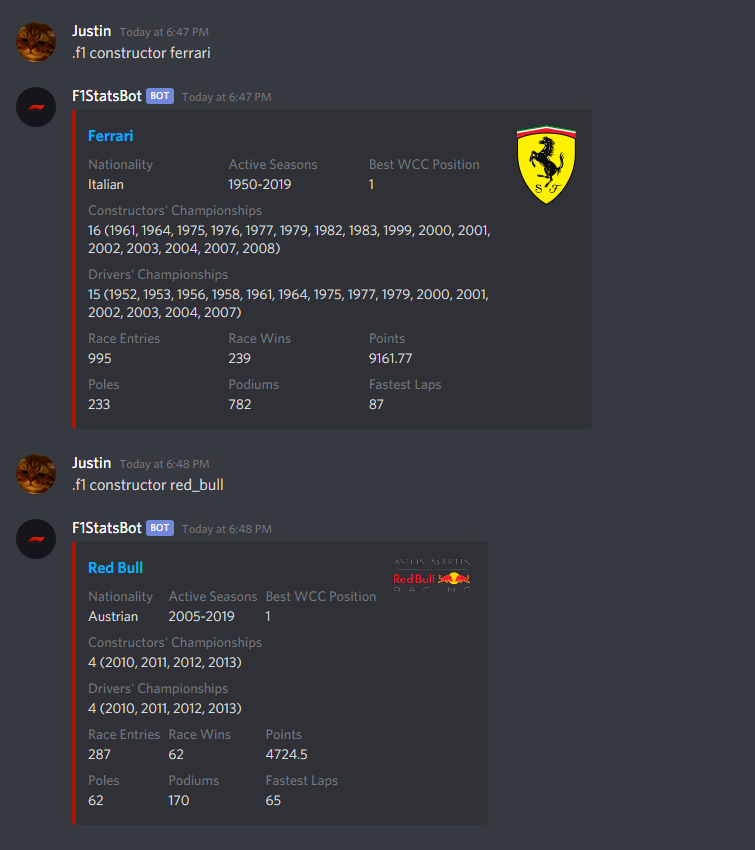

## 🏁 F1StatsBot 🏁
F1StatsBot is a Discord bot that allows you to look up various Formula One statistics through simple commands.  
Built using the [Java Discord API (JDA)](https://github.com/DV8FromTheWorld/JDA) and [JDA-Utilities](https://github.com/JDA-Applications/JDA-Utilities), utilizing data from the [Ergast Developer API](http://ergast.com/mrd/).

## Commands
`[ ]` = optional; `< >` = required
- **`.f1 help [command]`** - Displays a help guide for the command specified. If no command is specified, a list of all commands available will be displayed instead.
    

Example Usage

   
    
    

- **`.f1 circuit <circuit_id>`** - Displays information about the circuit with the specified id.
    

Example Usage

   
    
    

- **`.f1 circuits [page]`** - Displays a list of circuits and their id's for reference purposes.
    

Example Usage

   
    
    

- **`.f1 constructor <constructor_id>`** - Displays information about the constructor with the specified id.
    

Example Usage

   
    
    

- **`.f1 constructors [page]`** - Displays a list of constructors and their id's for reference purposes.
    

Example Usage

   
    
    

- **`.f1 driver <driver_id>`** - Displays information about the driver with the specified id.
    

Example Usage

   
    
    

- **`.f1 drivers [page]`** - Displays a list of drivers and their id's for reference purposes.
    

Example Usage

   
    
    

- **`.f1 next`** - Displays information about the next Formula One race.
    

Example Usage

   
    
    

- **`.f1 qualifying [<season> <round>]`** - Displays qualifying results for the race specified by `<round>` in the specified `<season>`. If no race is given, the qualifying results of the previous race will be displayed.
    

Example Usage

   
    
    

- **`.f1 race [<season> <round>]`** - Displays driver results for the race specified by `<round>` in the specified `<season>`. If no race is given, the driver results of the previous race will be displayed.
    

Example Usage

   
    
    

- **`.f1 schedule [season]`** - Displays the race schedule for the specified `[season]`. If no season is specified, the schedule of the current season will be displayed.
    

Example Usage

   
    
    

- **`.f1 season [season]`** - Displays the constructor and driver standings for the specified `[season]`. If no season is specified, the constructor and driver standings of the current season will be displayed.
    

Example Usage

   
    
    
